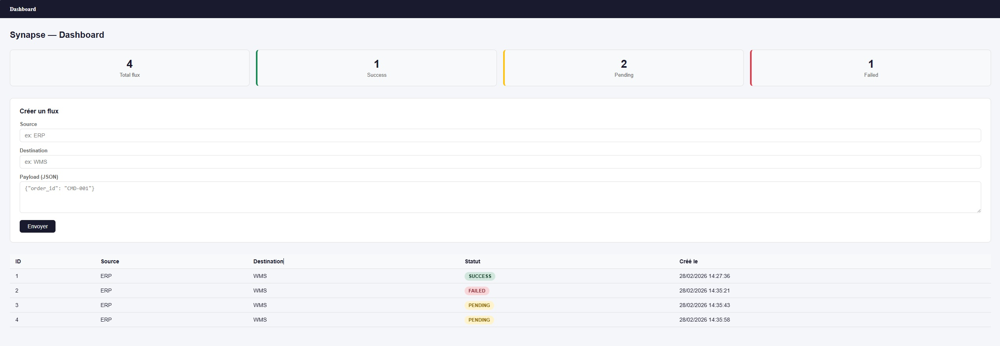

# Synapse — Enterprise Middleware API


API middleware d'intégration de données entre systèmes d'information (ERP/WMS).

## Projet

Simulation d'une infrastructure middleware réelle permettant la circulation,
la validation et la transformation de données entre logiciels internes.

Ce projet reproduit le besoin métier de Kermené (17ème entreprise agroalimentaire
française, filiale E.Leclerc) : remplacer les outils qui font circuler les
informations entre les logiciels de production et de logistique.

## Contexte

Projet développé dans le cadre d'une recherche d'alternance en développement
Full Stack (BAC+5 Concepteur-Développeur). L'objectif est de démontrer des
compétences techniques concrètes en :

- Conception et développement d'API REST (Spring Boot)
- Architecture middleware et intégration de systèmes
- Développement frontend de monitoring (Vue.js)
- Containerisation et déploiement (Docker)
- Conception de bases de données (MySQL)

## Résultats



### API testée et fonctionnelle
```bash
GET  /api/health  → {"status":"UP","service":"Synapse API","version":"1.0.0"}
GET  /api/stats   → {"success":1,"failed":1,"total":4,"pending":2,"retry":0}
GET  /api/flux    → Liste complète des flux
POST /api/flux    → Création d'un flux ERP → WMS
```


## Architecture
```
[ERP Simule] ──> [API Spring Boot] ──> [WMS Simule]
                        │
                   [MySQL - Logs]
                        │
                [Vue.js - Monitoring]
```

## Stack Technique

| Couche          | Technologie            |
|-----------------|------------------------|
| Back-end        | Java 21 + Spring Boot 3|
| Front-end       | Vue.js 3               |
| Base de donnees | MySQL 8                |
| Conteneurisation| Docker + Compose       |
| CI/CD           | Jenkins (prevu)        |
| Cloud (cible)   | Google Cloud Platform  |
| Versioning      | Git / GitHub           |

## Structure du Projet
```
synapse/
├── backend/          # API Spring Boot (Java)
├── frontend/         # Dashboard Vue.js
├── docs/             # Specifications, MCD/MLD, architecture
├── scripts/          # Scripts utilitaires
├── screenshots/      # Captures dashboard et API
├── docker-compose.yml
└── README.md
```

## Fonctionnalites

- [x] API REST Spring Boot (reception flux ERP)
- [x] Validation et transformation des donnees
- [x] Persistance MySQL (historique des flux)
- [x] Dashboard Vue.js (statut des flux en temps reel)
- [x] Dockerisation complete
- [x] Gestion des statuts (PENDING, SUCCESS, FAILED, RETRY)
- [x] Endpoint statistiques
- [ ] Retry automatique
- [ ] Pipeline Jenkins
- [ ] Deploiement GCP

## Lancement
```bash
# Cloner le projet
git clone https://github.com/ThomasWEBDEV/synapse.git
cd synapse

# Lancer l'API + base de donnees
docker-compose up -d

# Lancer le dashboard
cd frontend && npm run serve
```

API disponible sur : http://localhost:8080/api  
Dashboard disponible sur : http://localhost:8081

## Auteur

Thomas

Etudiant BAC+5 Concepteur-Developpeur Full Stack
Recherche alternance developpement — Septembre 2026
GitHub : https://github.com/ThomasWEBDEV

## Licence

MIT License — Libre utilisation a des fins educatives et professionnelles.
