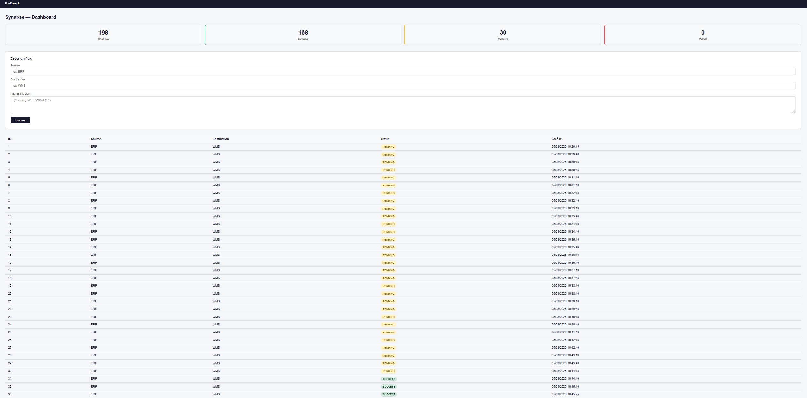
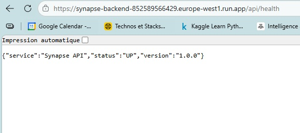
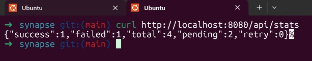
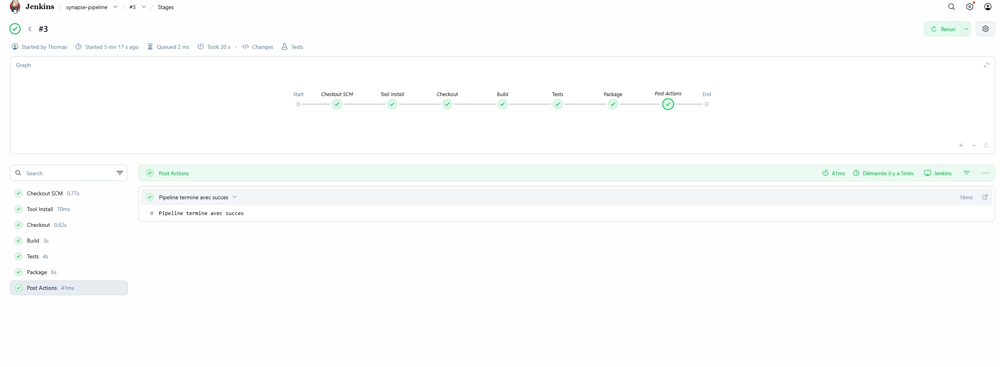
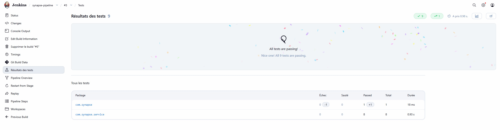
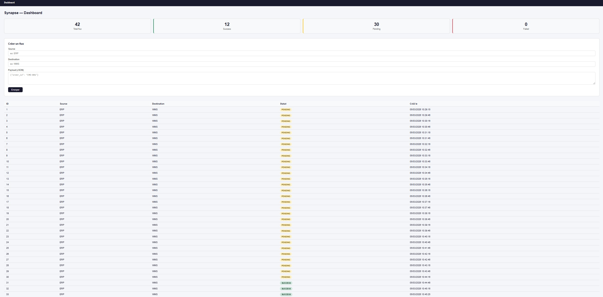
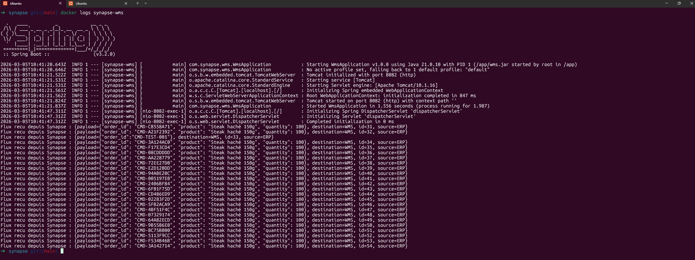

# Synapse - Enterprise Middleware API


## Présentation

Synapse est un projet full stack de niveau professionnel simulant une infrastructure middleware réelle d'intégration de données entre systèmes d'information industriels.

Le projet reproduit un besoin métier concret rencontré dans les grandes entreprises du secteur agroalimentaire et logistique : faire circuler, valider et transformer les données entre un ERP (gestion de production) et un WMS (gestion d'entrepôt) via une API centralisée, traçable et maintenable.

Trois systèmes indépendants ont été conçus, développés et déployés from scratch :

**L'ERP simulé** génère automatiquement des commandes toutes les 30 secondes et les envoie au middleware via des requêtes HTTP - reproduisant le comportement d'un vrai système de production industrielle.

**Synapse - le middleware central** reçoit, valide, transforme et persiste chaque flux en base de données MySQL, gère les statuts (PENDING, SUCCESS, FAILED, RETRY), expose une API REST complète et fournit un dashboard de monitoring en temps réel développé en Vue.js 3.

**Le WMS simulé** reçoit les flux transmis par le middleware et accuse réception - bouclant ainsi la chaîne complète ERP -> Synapse -> WMS.

L'ensemble de l'infrastructure est containerisé avec Docker Compose. Un pipeline Jenkins CI/CD automatise le build, les tests unitaires (JUnit 5 + Mockito) et le packaging à chaque push Git. Le backend a été déployé en production sur Google Cloud Run avec l'image Docker stockée sur Google Artifact Registry - accessible via une URL publique HTTPS.

Ce projet couvre l'intégralité de la stack technique attendue en entreprise : Java 21, Spring Boot 3, Vue.js 3, MySQL 8, Docker, Jenkins, Google Cloud Platform et Git.

## Compétences démontrées

- Conception et développement d'API REST (Spring Boot 3 - Java 21)
- Architecture middleware et intégration de systèmes (ERP -> Synapse -> WMS)
- Développement frontend de monitoring en temps réel (Vue.js 3)
- Containerisation complète (Docker + Docker Compose)
- Tests unitaires (JUnit 5 + Mockito - 9 tests, 0 échec)
- Pipeline CI/CD automatisé (Jenkins - build, test, package)
- Déploiement cloud (Google Cloud Run + Artifact Registry)
- Conception de bases de données (MySQL 8)
- Versioning professionnel (Git - 60+ commits atomiques)

## Résultats



### API déployée sur Google Cloud Platform
```
https://synapse-backend-852589566429.europe-west1.run.app/api/health
```



### API testée et fonctionnelle
```bash
GET  /api/health  → {"status":"UP","service":"Synapse API","version":"1.0.0"}
GET  /api/stats   → {"success":1,"failed":1,"total":198,"pending":196,"retry":0}
GET  /api/flux    → Liste complète des flux
POST /api/flux    → Création d'un flux ERP -> WMS
```



### Pipeline CI/CD Jenkins





### Communication ERP -> Synapse -> WMS

198 flux générés et transmis automatiquement en temps réel.





## Architecture
```
[ERP Simule] ──> [API Spring Boot] ──> [WMS Simule]
                        |
                   [MySQL - Logs]
                        |
                [Vue.js - Monitoring]
```

## Stack Technique

| Couche           | Technologie             |
|------------------|-------------------------|
| Back-end         | Java 21 + Spring Boot 3 |
| Front-end        | Vue.js 3                |
| Base de données  | MySQL 8                 |
| Conteneurisation | Docker + Compose        |
| CI/CD            | Jenkins                 |
| Tests            | JUnit 5 + Mockito       |
| Cloud            | Google Cloud Run        |
| Registry         | Google Artifact Registry|
| Versioning       | Git / GitHub            |

## Structure du Projet
```
synapse/
├── backend/           # API Spring Boot - middleware central
├── frontend/          # Dashboard Vue.js - monitoring
├── erp/               # Simulateur ERP - envoi automatique de commandes
├── wms/               # Simulateur WMS - réception et traitement
├── docs/              # Spécifications, architecture
├── screenshots/       # Captures dashboard, API, Jenkins, GCP
├── Jenkinsfile        # Pipeline CI/CD
├── docker-compose.yml
└── README.md
```

## Fonctionnalités

- [x] API REST Spring Boot (réception flux ERP)
- [x] Validation et transformation des données
- [x] Persistance MySQL (historique des flux)
- [x] Dashboard Vue.js (statut des flux en temps réel)
- [x] Dockerisation complète
- [x] Gestion des statuts (PENDING, SUCCESS, FAILED, RETRY)
- [x] Endpoint statistiques
- [x] Tests unitaires (9 tests, 0 échec)
- [x] Pipeline Jenkins (build, test, package)
- [x] Simulateur ERP - envoi automatique toutes les 30s
- [x] Simulateur WMS - réception et traitement
- [x] Déploiement Google Cloud Run
- [ ] Retry automatique
- [ ] Cloud SQL

## Lancement
```bash
# Cloner le projet
git clone https://github.com/ThomasWEBDEV/synapse.git
cd synapse

# Lancer tous les services
docker-compose up -d

# Lancer le dashboard
cd frontend && npm run serve
```

| Service  | URL                        |
|----------|----------------------------|
| API      | http://localhost:8080/api  |
| Dashboard| http://localhost:8083      |
| Jenkins  | http://localhost:8090      |
| ERP      | http://localhost:8083      |
| WMS      | http://localhost:8082      |

## Auteur

Thomas Feret

Développeur Full Stack
Bretagne - Février 2026
GitHub : https://github.com/ThomasWEBDEV

## Licence

MIT License - Libre utilisation à des fins éducatives et professionnelles.
